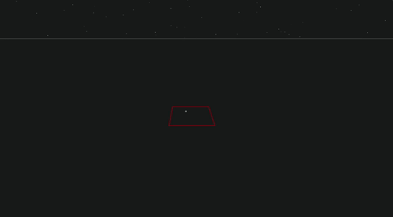

# simple voxel game

a very simple voxel game that i made using only [2d canvas](https://developer.mozilla.org/de/docs/Web/API/CanvasRenderingContext2D).  

the game has simple physics like jumping and collision with voxels. 
leftclick to place a voxel and rightclick to destroy one.  

the code is not optimized at all and adding a couple hunded voxels will cause the framerate to drop!  

game: https://xenodochial-galileo-70d0a4.netlify.app/

## why and how?

i just had the strong urge to figure out an occlusion algorithm for voxels and then render them with CanvasRenderingContext2D, my favourite graphics API.  

[check out some sweet visualizations of the occlusion algorithm! (the page contains large gifs so make sure your wifi is on)](./occlusion-visualizations/README.md)
