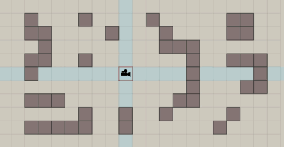
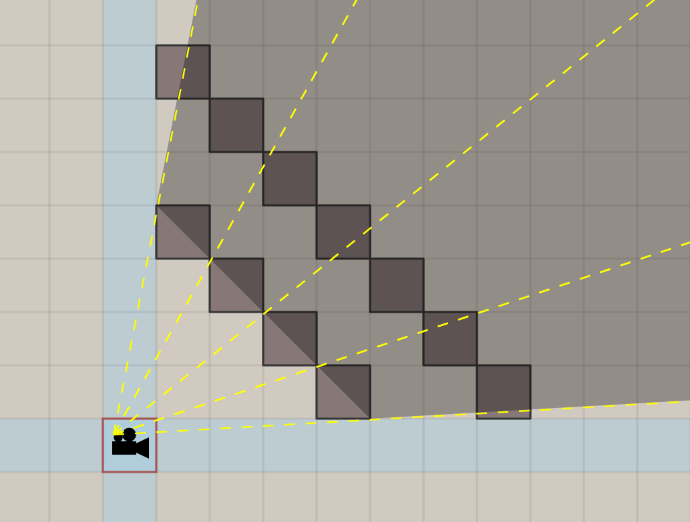
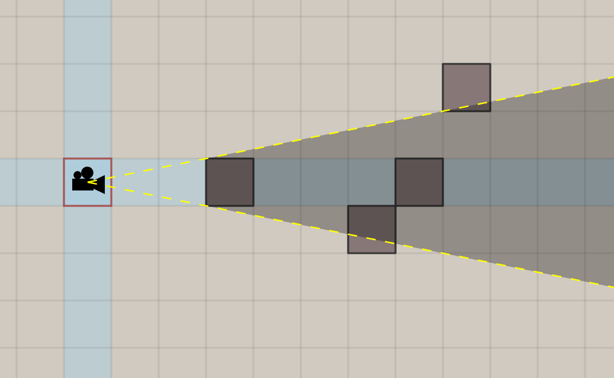
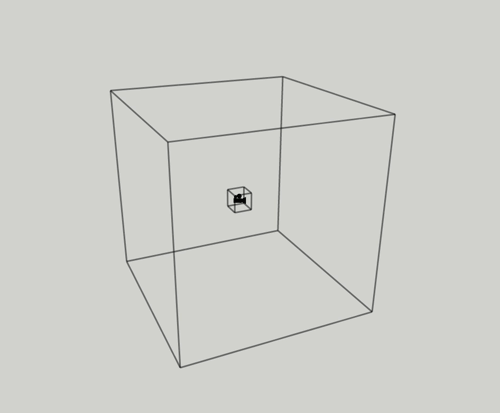


# the occlusion algorithm  

without occlusion, the order of the voxels will be wrong  

  

here is a simple visualization of how the voxels are ordered  

  

diagonal lines occlude other diagonal lines further away. voxels in the same diagonal don't occlude each other. their order is irrelevant. 

  

voxels on the blue line can occlude voxels in the adjacent quadrants.  

  

but not the other way around!  

  

this principle extends to higher dimensions.  
here is the order of rendering in an empty 3D box:  

  

and now when the box has some voxels  

  